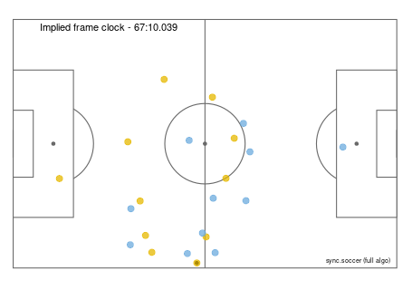

# sync.soccer ![badge-experimental]

sync.soccer synchronises (or _aligns_) soccer
datasets, so that an event in one dataset is matched to the corresponding
event or snapshot in the other. This repository contains an 
implementation that aligns Opta's 
(now STATS Perform's) F24 feeds to ChyronHego's Tracab files. More
formats may be added in the future. The heart of sync.soccer is the
[Needleman-Wunsch][link-nwwiki] dynamic programming algorithm. For a 
fuller explanation of the method see separate [blogpost][link-blog]. 

## Table of contents
### [Installation](#installation)<br>
### [Usage](#usage)
### [Known issues and troubleshooting](#troubleshooting)
* [Missing Tracab metadata](#missing-metadata)
* [Performace and system requirements](#performance)
* [Unsatisfactory alignments](#bad-alignments)
### [License](#license)

<a name="installation"/>

## Installation

sync.soccer has been developed and tested on Ubuntu Linux.
Feedback on compilation and performance on other platforms is 
welcome. To build sync.soccer, you need [Stack][link-stack]. 
Then, to download and compile, say:

```sh
$ git clone git@github.com:huffyhenry/sync.soccer.git
$ cd sync.soccer
$ stack build
```
<a name="usage"/>

## Usage

If the build was successful, you can run sync.soccer like so
(note the double dash, which tells Stack that all arguments that follow
are meant for the sync-soccer executable and not for Stack itself):
```
$ stack exec -- sync-soccer --help

Usage: sync-soccer TRACAB-META TRACAB-DATA F7 F24 OUTPUT [-t|--time-only] 
                   [-u|--timestamp] [-s|--show-sync] [-c|--scale-clock X] 
                   [-l|--scale-location X] [-p|--scale-player X] 
                   [-b|--scale-ball X] [-e|--event-csv FILEPATH] 
                   [-f|--frame-csv FILEPATH]
  Synchronise Tracab and F24 data.

Available options:
  -t,--time-only           Sync only by time
  -u,--timestamp           Use F24 event timestamp instead of min:sec
  -s,--show-sync           Print human-readable sync on screen
  -c,--scale-clock X       Clock mismatch leading to unit penalty [s, def=1]
  -l,--scale-location X    Location mismatch leading to unit penalty [m, def=5]
  -p,--scale-player X      Player-ball gap leading to unit penalty [m, def=1]
  -b,--scale-ball X        Penalty for syncing to dead-ball frame [def=5]
  -e,--event-csv FILEPATH  Location to save F24 events CSV
  -f,--frame-csv FILEPATH  Location to save Tracab frames CSV
  -h,--help                Show this help text
```
You must specify five file paths: to Tracab metadata, 
Tracab payload, F7 file (essentially F24 metadata), F24 file and
a path to the output file where the completed alignment will be saved
as a CSV of event and frame IDs.

The meaning of the optional arguments is as follows:
* `--time-only` discards all the added value of the algorithm and matches
  the events to the frame nearest to it in time. Useful for debugging,
  comparisons or when the algorithm misbehaves on a particuar game.
* `--timestamp` uses the F24 event timestamp instead of minute and second
  as the time of the event.
* `--show-sync` will print the alignment on screen. It will look something
  like this:
  ```
  Event <event id> (67:12 Pass)          Frame <frame id> (implied clock: 67:12.920)
  --gap length 55--                            
  Event <event id> (67:15 Pass)          Frame <frame id> (implied clock: 67:15.160)
  --gap length 30--                            
  Event <event id> (67:16 Clearance)     Frame <frame id> (implied clock: 67:16.400)
  --gap length 26--                            
  Event <event id> (67:17 Ball recovery) Frame <frame id> (implied clock: 67:17.480)
  Event <event id> (67:18 Pass)          Frame <frame id> (implied clock: 67:17.520)
  --gap length 35--                            
  Event <event id> (67:19 Pass)          Frame <frame id> (implied clock: 67:18.960)
  --gap length 50--                            
  Event <event id> (67:21 Pass)          Frame <frame id> (implied clock: 67:21.000)
  --gap length 118--                           
  Event <event id> (67:26 Pass)          Frame <frame id> (implied clock: 67:25.760)
  --gap length 104--                           
  Event <event id> (67:30 Pass)          Frame <frame id> (implied clock: 67:29.960)
  --gap length 42--                            
  Event <event id> (67:32 Miss)          Frame <frame id> (implied clock: 67:31.680)
  ```
* The parameters starting with `--scale` control the _relative_ importance of the
  four components of the event-frame similarity score: difference of time, location,
  distance between the player identified by the event and the ball, and ball
  status (alive/dead). The default values were chosen by trial and error, and
  force the algorithm to penalise equally a 5 metre discrepancy in location, 
  1 second discrepancy in time, and 1 metre distance between the active player
  and the ball. Because the similarity score between any event and any frame
  falls in (0, 1), the default `--scale-ball` value of 5 means that the algorithm
  can never align to a dead-ball frame.
* `--event-csv` and `--frame-csv` write the event and frame data to files
  in a format compatible with the visualisation scripts in `viz/`.
  

<a name="troubleshooting"/>

## Known issues and troubleshooting

<a name="missing-metadata"/>

### Missing Tracab metadata
You may have received a Tracab file without the corresponding metadata.
Tracab metadata is a small XML file that nevertheless contains
essential information for the synchronisation algorithm: pitch size, 
frame rate and the beginning and end of the first and second half. 
If you know 
these parameters or can deduce them from raw data, you can mock up a 
metadata file based on this template:

```xml
<TracabMetaData sVersion="1.0">
    <match iId="0" dtDate="0" iFrameRateFps="25" fPitchXSizeMeters="105.00" fPitchYSizeMeters="68.00" fTrackingAreaXSizeMeters="0.00" fTrackingAreaYSizeMeters="0.00">
        <period iId="1" iStartFrame="<value>" iEndFrame="<value>"/>
        <period iId="2" iStartFrame="<value>" iEndFrame="<value>"/>
        <period iId="3" iStartFrame="0" iEndFrame="0"/>
        <period iId="4" iStartFrame="0" iEndFrame="0"/>
    </match>
</TracabMetaData>
```
Currently, sync.soccer cares only about the `iFrameRateFps`, 
`iStartFrame`, `iEndFrame`, `fPitchXSizeMeters` and `fPitchYSizeMeters` 
values. The rest can be set to 0. In fact, you only _really_ need
the `iStartFrame` values: `iEndFrame` can safely be set to something
corresponding to a time after the half ended (at a small performace cost), 
frame rate is usually (always?) 25, and you may get decent enough results 
using the standard pitch size of 105x68 metres (and perhaps increasing the 
`--scale-location` value).

<a name="performance"/>

### Performance and system requirements
The core algorithm needs to build two ~75'000 (# of Tracab frames) x 
~800 (# of F24 events) matrices, one for each half of the match, 
to find the optimal alignment. This requires time and space.
On my machine, the program needs 5-10 minutes and ~10 GB of RAM to
synchronise a single game. There is a lot of low-hanging fruit to be
picked in terms of optimisation, and I expect future versions of the
software to be much more streamlined. Parallel synchronisation of 
game halves is also in the works.

<a name="bad-alignments"/>

### Unsatisfactory alignments
Sometimes an alignment produced by sync.soccer contains segments
that are demonstrably worse than if synchronisation were performed
purely on the basis of time. They are typically a result of discrepancies 
between the F24 and Tracab data that are greater than is reasonable,
for example due to very inaccurate F24 event location or even
Tracab ball tracking error. In such situations, the algorithm may align
event(s) to frame(s) that are a significant time apart, but where 
(by chance) the
locations agree better. Such mis-alignment can then have a knock-on
effect on the next several seconds of data, until everything straightens 
out.

One solution in these situations is to increase the `--scale-location`
parameter, making the algorithm less sensitive to differences in
event and ball locations. Another is to run a second synchronisation
with `--time-only` and manually (or using a script) merge the two sync 
files so that the
problematic events are aligned only based on time. The time slippage
plot in `viz/slippage.R` can help identify the 
potentially problematic segments, which can then be animated with
`viz/animate.R` to see what is going on.

Such pathological situations need to be distinguished from those
when the algorithm produces an imperfect but reasonable
alignment. These may eventually be corrected by developing smarter,
more granular event-frame agreement scoring functions.

<a name="license"/>

## License
Copyright (c) 2018-2020 Allan Clark and Marek Kwiatkowski.

This program is free software: you can redistribute it and/or modify 
it under the terms of the GNU Affero General Public License as published 
by the Free Software Foundation, either version 3 of the License, 
or (at your option) any later version.

This program is distributed in the hope that it will be useful, but WITHOUT ANY WARRANTY; without even the implied warranty of MERCHANTABILITY or FITNESS FOR A PARTICULAR PURPOSE. 
See the GNU Affero General Public License for more details.

You should have received a copy of the GNU Affero General Public License along with this program. If not, see <https://www.gnu.org/licenses/>. 


[header-clip]: doc/header-clip.gif
[badge-experimental]: https://img.shields.io/badge/lifecycle-proof%20of%20concept-important
[link-nwwiki]: https://en.wikipedia.org/wiki/Needleman%E2%80%93Wunsch_algorithm
[link-blog]: https://kwiatkowski.io/sync.soccer
[link-stack]: https://docs.haskellstack.org/en/stable/README/